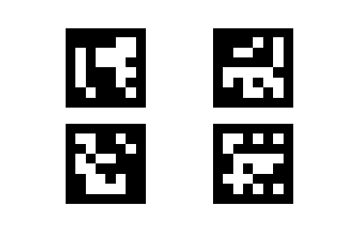

# A short script to detect and patch a video on an other

## About

This script is mainly made for educationnal purpose to explain the role of homography and a common application which is the patching of an image in an other one.


The program relies on the OpenCV and ArUco libraries to perform the detection of the markers and the homography patching.

This kind of patching is offently made seamlessly in softwares such as Adobe premiere or Adboe After Effects, but these ones relies on subfunctions calls to the openCV library. The goal of this repository is to present how heavy software uses the patching method with a more pratical view which is the detection of corners (made with arUco markers) and the patching with an homography.

_Consider this script as the level 0 of the 3D incrustation_

**Note that the script needs the libraries numpy, openCV and aruco to work correctly.**

## Markers generation

The ArUco markers can be generated from this short script :

```
from cv2 import aruco
import matplotlib.pyplot as plt
import matplotlib as mpl

aruco_dict = aruco.Dictionary_get(aruco.DICT_6X6_250)

fig = plt.figure()
nx = 2
ny = 2
for i in range(1, nx*ny+1):
    ax = fig.add_subplot(ny,nx, i)
    img = aruco.drawMarker(aruco_dict,i, 700)
    plt.imshow(img, cmap = mpl.cm.gray, interpolation = "nearest")
    ax.axis("off")

plt.savefig("markers.pdf")
plt.show()
```

Once this is done, the markers can be printed on a board (or any other support).



## How to use

The program comes with some small features such as the possibility to write an output file of the result or the possibility to use the camera of the laptop to detect the markers and patch the homography.

You have to change the number of your marker ids to respect the following order :

**top left, top right, bottom right, bottom left.**

furthermore, some lines of the script can be uncommented to provide a feedback to the user, such as the id number of the markers or their centers...

# license terms
_(just in case)_

This program is free software: you can redistribute it and/or modify it under the terms of the GNU General Public License as published by the Free Software Foundation, either version 3 of the License, or (at your option) any later version.

This program is distributed in the hope that it will be useful, but WITHOUT ANY WARRANTY; without even the implied warranty of MERCHANTABILITY or FITNESS FOR A PARTICULAR PURPOSE. See the GNU General Public License for more details.